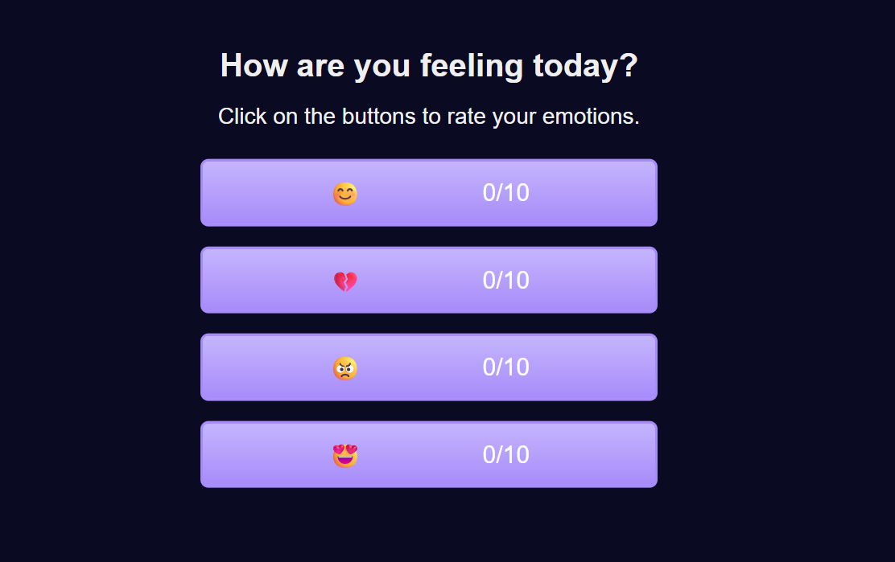

😊 Reaction Counter

A simple and interactive Emoji Reaction Counter built using HTML, CSS, and JavaScript (DOM API).
This web app lets users express how they feel by clicking on emojis — each representing a different emotion and score

👉 Live Demo: samir-bk.github.io/Reaction-Counter

💡 Features

🎭 Four expressive emojis to rate your emotions

🔢 Real-time counter updates dynamically using the DOM API

🎨 Modern UX/UI design with soft gradients, dark theme, and responsive layout

🧠 Clean, minimal interface that feels intuitive and fun to use

💬 Helps visualize emotional states in a playful way

🧩 How It Works

The app uses the Document Object Model (DOM) to detect and respond to user clicks on emoji buttons.
Each click triggers a JavaScript event listener, which updates the counter for that specific emoji in real time — no page refresh needed.

🛠️ Built With

HTML5 – Structure and layout

CSS3 – Styling, colors, and responsive design

JavaScript (ES6) – Logic for counting and interactions

🎨 Design & UX/UI

The goal was to make a simple, visually calm, and emotionally engaging interface.

Dark background for focus and contrast

Soft violet gradients for warmth

Large, centered buttons for easy interaction

Accessible color contrast and clean typography

🚀 How It Works

Open the app in your browser.

Click on any emoji to “rate” your current mood.

The counter beside each emoji updates instantly to reflect your input.

🧩 Project Structure
Reaction-Counter/
│
├── index.html
├── style.css
├── script.js
└── README.md

🎨 Screenshot

;

🧑‍💻 Author

Samir B K
🎓 Software Development Student at Haaga-Helia University of Applied Sciences
💼 [GitHub Profile](https://github.com/Samir-BK)
